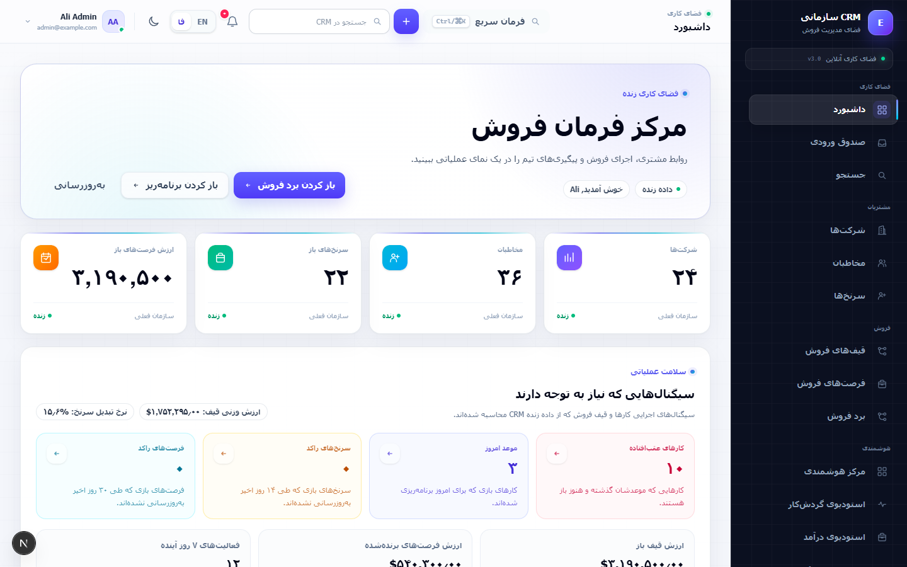
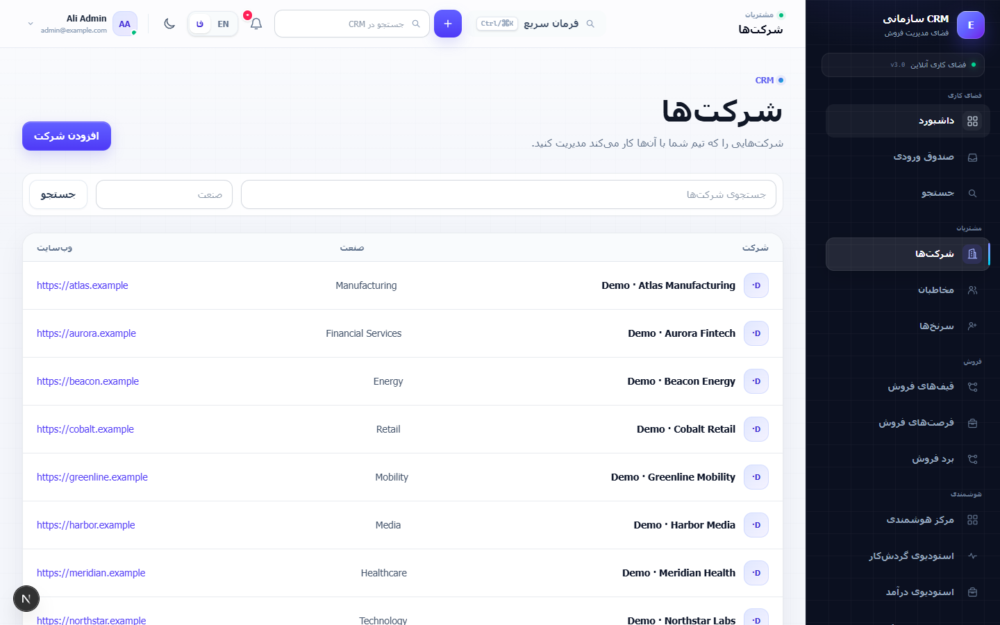
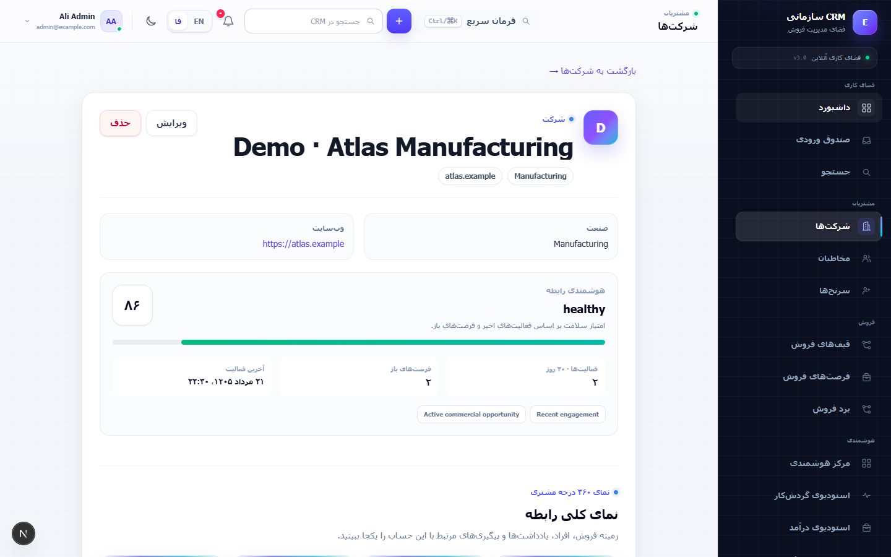
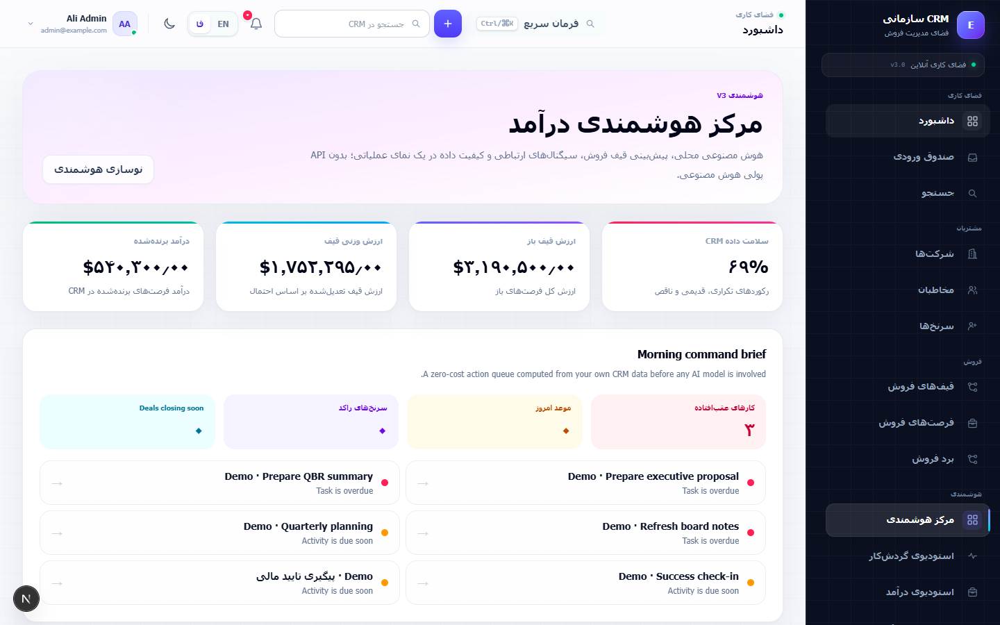
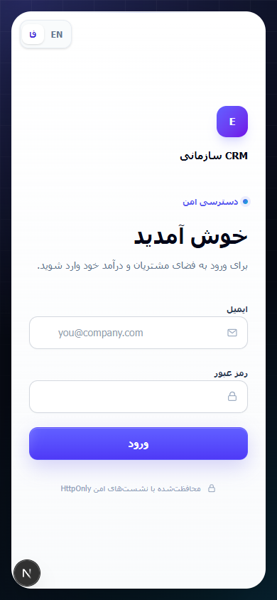
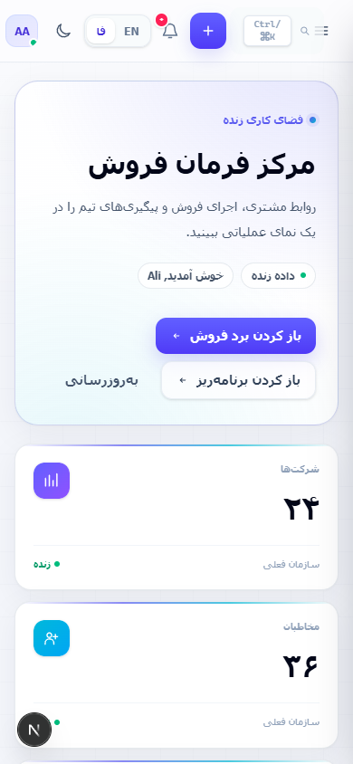
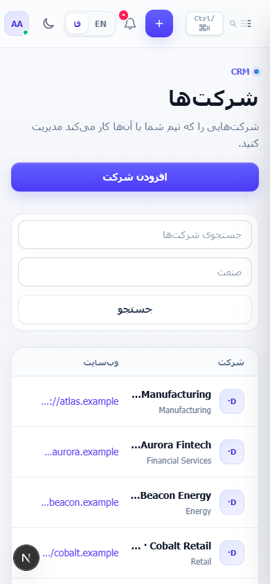
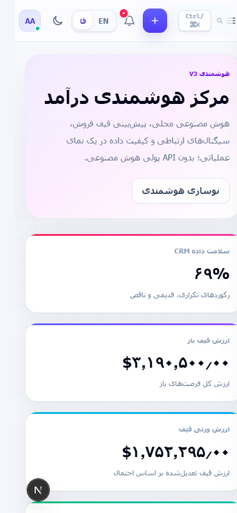

# Enterprise CRM

[فارسی](README.fa.md) | [English](README.md)

    

یک CRM چندمستاجره و مدرن برای مدیریت ارتباط با مشتری، فرآیند فروش و اجرای عملیات درآمد. Backend با FastAPI، رابط با Next.js، دسترسی مبتنی بر نقش، نشست‌های امن و هوش مصنوعی محلی اختیاری Ollama در کنار هم قرار گرفته‌اند.

<p align="center"></p>

## معرفی

Enterprise CRM شرکت‌ها، مخاطبان، سرنخ‌ها، فرصت‌های فروش، کارها، فعالیت‌ها، یادداشت‌ها، قیف فروش و گزارش‌ها را در یک فضای کاری یکپارچه جمع می‌کند. رابط کاربری واقعاً دوزبانه است: انگلیسی با LTR و فارسی با RTL. هوش مصنوعی محلی اختیاری است و نبود Ollama مانع استفاده از CRM نمی‌شود.

## قابلیت‌های کلیدی

- جداسازی داده‌ها در سطح سازمان و کنترل دسترسی مبتنی بر نقش
- احراز هویت با کوکی HttpOnly، چرخش نشست refresh و پشتیبانی MFA
- مدیریت شرکت، مخاطب، سرنخ، فرصت، کار، یادداشت، برچسب و قیف فروش
- داشبورد، پیش‌بینی درآمد، گزارش‌ساز و بررسی کیفیت داده‌ها
- رابط واکنش‌گرا، حالت تیره و ترجمه واقعی فارسی/انگلیسی
- دستیار Ollama محلی با پاسخ استریم و انتخاب مدل
- migrationهای Alembic؛ SQLite برای اجرای سریع محلی و PostgreSQL برای استقرار

## تصاویر

<p align="center"></p>
<p align="center"></p>
<p align="center"></p>

## تجربه موبایل

<p align="center">
  &nbsp;
  &nbsp;
  &nbsp;
  
</p>

## هوش مصنوعی محلی

Ollama به‌صورت اختیاری روی همان سیستم و به‌طور پیش‌فرض روی `127.0.0.1` اجرا می‌شود. دستیار می‌تواند با زمینه محدود و سازمانی CRM پاسخ بدهد و پاسخ را به‌صورت استریم نمایش دهد. این دستیار فقط مشورتی و فقط‌خواندنی است؛ رکوردی ایجاد، ویرایش یا حذف نمی‌کند. مدل‌های نصب‌شده و قابل انتخاب در بخش مرکز هوشمندی دیده می‌شوند. پاسخ مدل منبع قطعی داده نیست و باید با اطلاعات CRM بررسی شود.

## معماری

```text
مرورگر ← Next.js BFF ← FastAPI ← PostgreSQL
                         └→ Ollama محلی (اختیاری)
```

## ساختار پروژه

```text
enterprise-crm/
├── backend/       FastAPI، مدل‌ها، سرویس‌ها و migrationهای Alembic
├── frontend/      رابط Next.js و مسیرهای BFF
├── docs/screenshots/
├── amade_sazi.bat آماده‌سازی ویندوز
├── run.bat        اجرای پروژه
└── stop.bat       توقف سرویس‌ها
```

## اجرای سریع در ویندوز

1. Python 3.11+ و Node.js 20+ را نصب کنید.
2. روی `amade_sazi.bat` دوبار کلیک کنید. محیط Backend، وابستگی‌ها، تنظیمات محلی و migrationها آماده می‌شوند.
3. روی `run.bat` دوبار کلیک کنید و `http://localhost:3000` را باز کنید.
4. برای توقف سرویس‌های اجراشده از `stop.bat` استفاده کنید.

هنگام ساخت نخستین `backend/.env`، رمز محلی مدیر در پنجره Setup نمایش داده می‌شود. این فایل در Git نادیده گرفته می‌شود و هرگز Push نمی‌شود.

## نصب دستی

```powershell
py -3.11 -m venv backend/.venv
backend/.venv/Scripts/python -m pip install -e "backend[dev]"
Copy-Item backend/.env.example backend/.env
Push-Location backend
.venv/Scripts/python -m alembic upgrade head
.venv/Scripts/python -m app.scripts.seed_development
.venv/Scripts/python -m uvicorn app.main:app --reload --host 127.0.0.1 --port 8000
```

در یک ترمینال دیگر:

```powershell
Push-Location frontend
Copy-Item .env.local.example .env.local
npm ci
npm run dev
```

برای استقرار، `DATABASE_URL` در `backend/.env` را با URL سازگار SQLAlchemy برای PostgreSQL تنظیم کنید و migrationها را از پوشه `backend` اجرا کنید.

## تنظیمات محیطی

فایل‌های `backend/.env.example` و `frontend/.env.local.example` مرجع کامل و امن تنظیمات هستند. متغیرهای اصلی شامل `DATABASE_URL`، `JWT_SECRET`، `DEFAULT_ORGANIZATION_ID`، `DEFAULT_ADMIN_*`، `OLLAMA_*`، `BACKEND_API_URL` و `NEXT_PUBLIC_API_BASE_URL` هستند. فایل‌های `.env` و `.env.local` را Commit نکنید.

## راه‌اندازی Ollama

Ollama را نصب و اجرا کنید، سپس مثلاً دستور `ollama pull gemma3:4b` را بزنید. در `backend/.env` مقدارهای `OLLAMA_ENABLED=true`، `OLLAMA_BASE_URL=http://127.0.0.1:11434` و یک `OLLAMA_MODEL` نصب‌شده را قرار دهید. اگر Ollama در دسترس نباشد، خود CRM همچنان قابل استفاده است.

## تست‌ها

```powershell
Push-Location backend
.venv/Scripts/python -m unittest discover -s tests
.venv/Scripts/python -m alembic check

Push-Location ../frontend
npm run lint
npm run typecheck
npm run build
```

## نکات امنیتی

پروژه از queryهای سازمان‌محور، RBAC، کوکی‌های HttpOnly، کنترل CSRF/origin و secretهای مبتنی بر Environment استفاده می‌کند. برای استقرار واقعی، TLS، فضای ذخیره‌سازی پایدار، backup، monitoring و اعتبارنامه‌های امن پایگاه‌داده ضروری است.

## محدوده فعلی

این Repository یک CRM قابل اجرا برای نمونه‌کار و self-hosting است؛ ادعای سرویس SaaS مدیریت‌شده یا جایگزین ارزیابی امنیتی عملیاتی ندارد.
