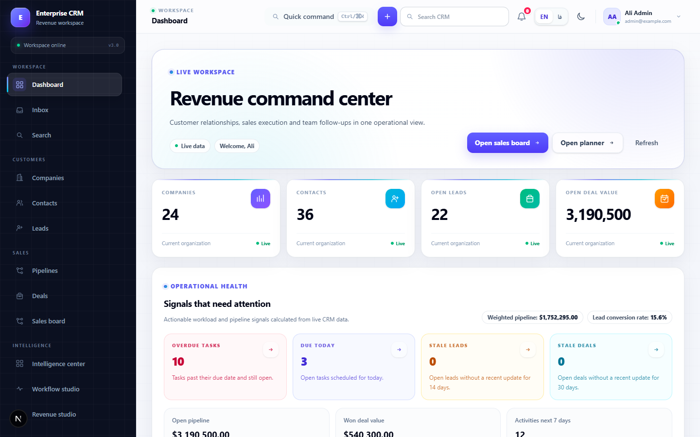
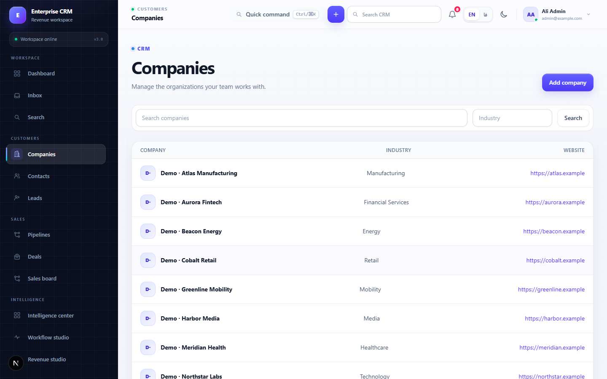
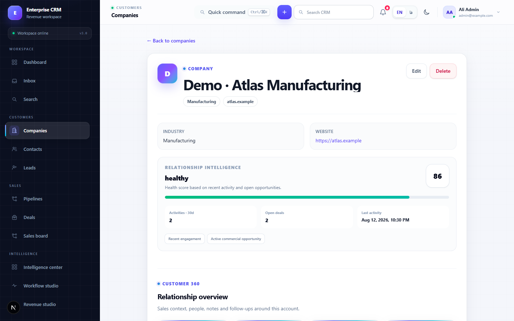
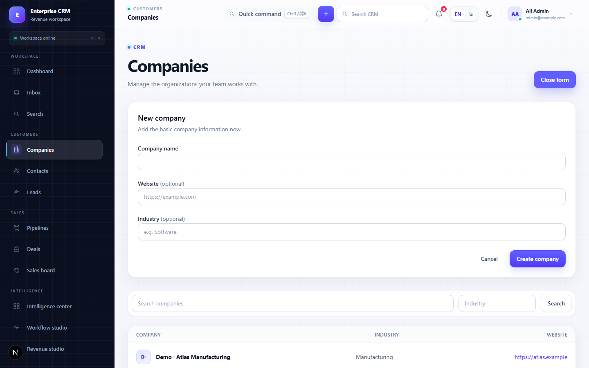
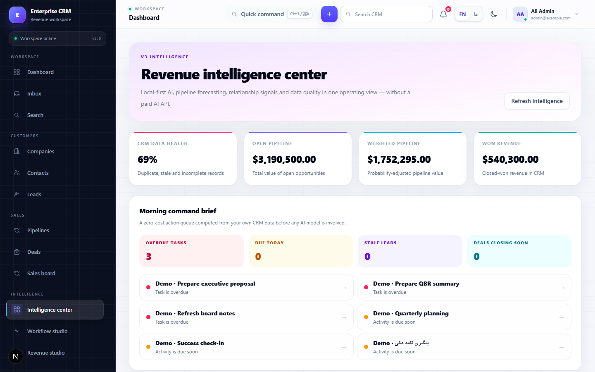
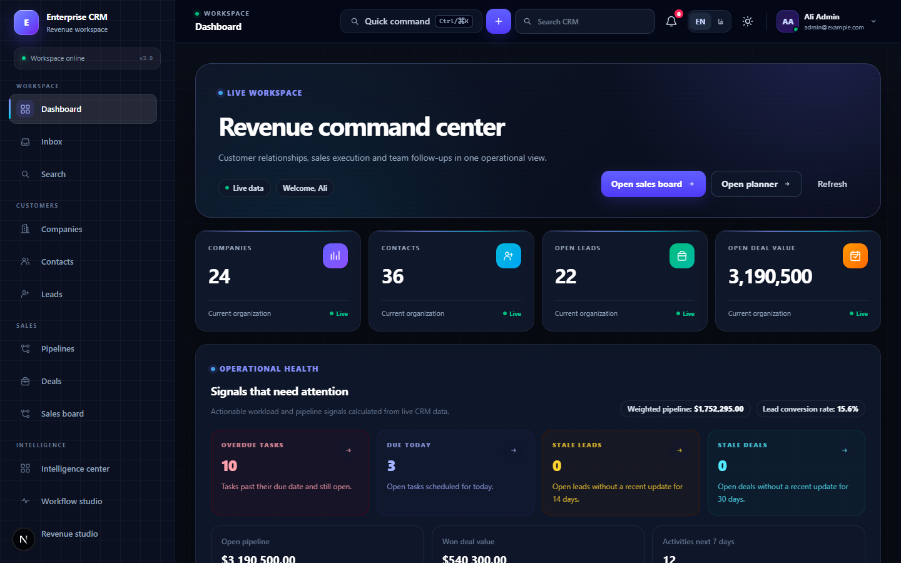
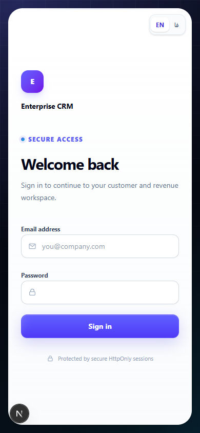
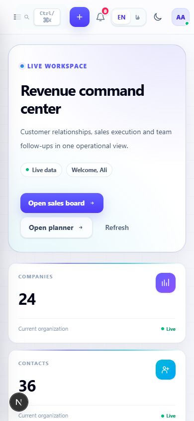
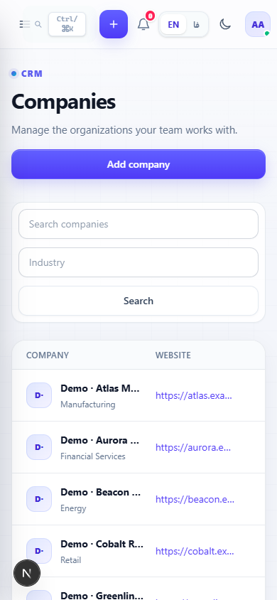
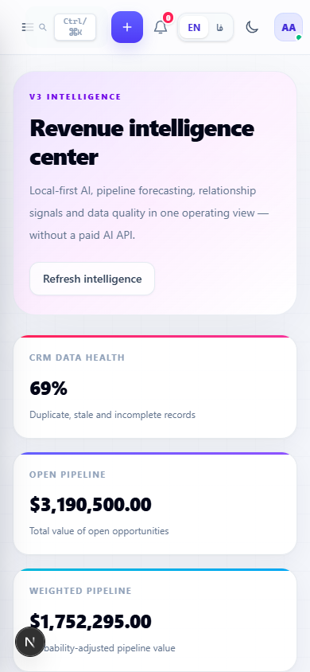

# Enterprise CRM

[English](README.md) | [فارسی](README.fa.md)

    

A modern, multi-tenant CRM for customer relationships, pipeline operations and revenue execution. It pairs a FastAPI backend with a Next.js interface, organization-scoped RBAC, refresh-token sessions, PostgreSQL-ready persistence and optional local Ollama AI.

<p align="center"></p>

## Overview

Enterprise CRM brings companies, contacts, leads, deals, tasks, activities, notes, pipelines and reporting into one workspace. The application is bilingual (English LTR and Persian RTL), responsive, and designed so local AI remains optional: the CRM works normally without Ollama.

## Highlights

- Organization-scoped data isolation and role-based permissions
- Secure authentication with HttpOnly session cookies, refresh-session rotation and MFA support
- Customer, contact, lead, deal, task, note, tag and pipeline management
- Dashboards, revenue forecasting, reports, data-quality signals and operational planning
- English/Persian localization with real RTL support, dark mode and responsive navigation
- Optional Ollama copilot with streaming responses and selectable local models
- Alembic migrations; SQLite for a quick local demo and PostgreSQL for production deployments

## Screenshots

<p align="center"></p>
<p align="center"></p>
<p align="center"></p>
<p align="center"></p>
<p align="center"></p>

## Mobile experience

<p align="center">
  &nbsp;
  &nbsp;
  &nbsp;
  
</p>

## Local AI

Ollama is optional and runs on the local machine (`127.0.0.1` by default). When available, the copilot can answer CRM questions using organization-scoped context and stream its response to the UI. It is advisory and read-only: it does not create, edit or delete records. Model availability and selection are shown in the Intelligence Center. Context is deliberately focused for responsiveness; the model must not be treated as a source of truth.

## Architecture

```text
Browser → Next.js BFF → FastAPI → PostgreSQL
                              └→ Ollama (optional, local)
```

## Project structure

```text
enterprise-crm/
├── backend/       FastAPI, SQLAlchemy models, services and Alembic migrations
├── frontend/      Next.js App Router UI and BFF routes
├── docs/screenshots/
├── amade_sazi.bat Setup launcher for Windows
├── run.bat        Run launcher for Windows
└── stop.bat       Stop launcher for Windows
```

## Quick start (Windows)

1. Install Python 3.11+ and Node.js 20+.
2. Double-click `amade_sazi.bat`. It creates the backend environment, installs dependencies, creates ignored local configuration when needed, applies migrations and prepares the local account.
3. Double-click `run.bat`, then open `http://localhost:3000`.
4. Use `stop.bat` to stop the locally launched services.

The launcher prints the generated local admin password when it creates `backend/.env`. That file is ignored by Git and is never part of the repository.

## Manual installation

```powershell
# Backend (from repository root)
py -3.11 -m venv backend/.venv
backend/.venv/Scripts/python -m pip install -e "backend[dev]"
Copy-Item backend/.env.example backend/.env
# set safe local values in backend/.env, then:
Push-Location backend
.venv/Scripts/python -m alembic upgrade head
.venv/Scripts/python -m app.scripts.seed_development
.venv/Scripts/python -m uvicorn app.main:app --reload --host 127.0.0.1 --port 8000
```

```powershell
# Frontend (in another terminal)
Push-Location frontend
Copy-Item .env.local.example .env.local
npm ci
npm run dev
```

For production, set `DATABASE_URL` in `backend/.env` to a PostgreSQL SQLAlchemy URL and run migrations from `backend`.

## Environment

Use `backend/.env.example` and `frontend/.env.local.example` as the complete, safe configuration references. Important variables are `DATABASE_URL`, `JWT_SECRET`, `DEFAULT_ORGANIZATION_ID`, `DEFAULT_ADMIN_*`, `OLLAMA_*`, `BACKEND_API_URL` and `NEXT_PUBLIC_API_BASE_URL`. Do not commit `.env` or `.env.local` files.

## Ollama setup

Install Ollama, start it, then pull a model such as `ollama pull gemma3:4b`. Keep `OLLAMA_ENABLED=true`, `OLLAMA_BASE_URL=http://127.0.0.1:11434`, and choose an installed `OLLAMA_MODEL` in `backend/.env`. The app clearly remains usable if Ollama is unavailable.

## Testing

```powershell
Push-Location backend
.venv/Scripts/python -m unittest discover -s tests
.venv/Scripts/python -m alembic check

Push-Location ../frontend
npm run lint
npm run typecheck
npm run build
```

## Security notes

The project uses organization-scoped queries, RBAC, HttpOnly session cookies, CSRF/origin controls and environment-based secrets. Configure TLS, durable storage, backups, monitoring and production-grade database credentials before deploying for real users.

## Current scope

This repository is a portfolio-ready local and self-hosted CRM implementation. It does not claim to be a managed SaaS service or a substitute for operational security review.
